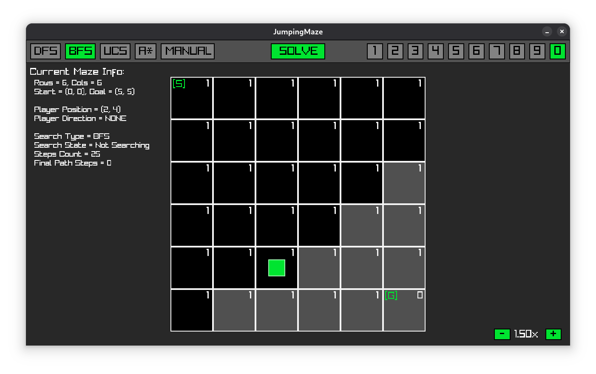

# Tarea 1: JumpingMaze - **Inteligencia Artificial S1-2025**

## 1. Introducción

Esta es la implementación del juego "JumpingMaze" para resolver el problema de
"Laberinto Saltarín", utilizando diferentes algoritmos de búsqueda para
resolver los diferentes laberintos.

 

### Alumno: Alonso Bustos E

## 2. Descripción del Problema

El Laberinto Saltarín se define como:

- Una grilla de m × n celdas, cada una con un número entero
- Una celda inicial y una celda de destino
- Reglas de movimiento:
  - Solo se permite moverse en cuatro direcciones
  - El número en la celda actual determina exactamente cuántas celdas se debe avanzar
  - No se puede salir de los límites del laberinto

El objetivo es encontrar una secuencia de movimientos que llegue desde la celda inicial hasta la celda destino.

## 3. Estructura del Programa

El programa está implementado en C utilizando la biblioteca Raylib para la
interfaz gráfica. La estructura del código se organiza en los siguientes principales módulos:

| Archivo      | Descripción                                  |
| ------------ | -------------------------------------------- |
| `main.c`     | Punto de entrada del juego                   |
| `game.c/h`   | Gestión del juego, inicialización y gameloop |
| `maze.c/h`   | Definición y manipulación de laberintos      |
| `search.c/h` | Implementación de algoritmos de búsqueda     |
| `update.c/h` | Lógica de actualización y manejo de input    |
| `render.c/h` | Renderizado gráfico del juego                |

### 3.3 Uso

Puedes compilar en Linux, y quizás en Windows, usando `make`. Pero antes
necesitas:

- **gcc** via apt/dnf/pacman (Linux) o [msys2/mingw](https://www.msys2.org/) (Windows)
- **git** via apt/dnf/pacman (Linux) o [git-scm.com](https://git-scm.com/downloads/win) (Windows)
- **raylib** via apt/dnf/pacman (Linux) o [msys2/mingw](https://packages.msys2.org/packages/mingw-w64-ucrt-x86_64-raylib) (Windows)
- **make** via apt/dnf/pacman (Linux) o [msys2/mingw](https://packages.msys2.org/packages/mingw-w64-ucrt-x86_64-make) (Windows)

Por ejemplo, en distribuciones de Linux tipo Debian/Ubuntu puedes usar:

```bash
sudo apt install gcc make git libraylib5-dev
```

Luego, puedes seguir estos pasos desde la terminal:

```bash
# Clonas el repositorio
git clone https://github.com/Ado-do/tarea1-IA

# Te diriges al repositorio
cd tarea-IA

# Compilas y ejecutas el programa
make run

# También puedes compilar y ejecutar por separado, dando la entrada
make
./build/JumpingMaze < input/test.txt
```

## 4. Algoritmos de Búsqueda Implementados

El juego implementa cuatro algoritmos de búsqueda (`search.c/h`), además de un modo manual:

### 4.1 Búsqueda en Profundidad (DFS)

- **Implementación**: `DFSStep()` en `search.c`
- **Funcionamiento**: Explora tan lejos como sea posible a lo largo de cada rama antes de retroceder.
- **Estructura de datos**: Utiliza un stack (`containerList` con `PushToStack()`) para almacenar los nodos por explorar.
- **Característica**: Consumo de memoria proporcional a la profundidad de búsqueda

### 4.2 Búsqueda en Anchura (BFS)

- **Implementación**: `BFSStep()` en `search.c`
- **Funcionamiento**: Explora todos los nodos vecinos a la misma distancia antes de moverse al siguiente nivel.
- **Estructura de datos**: Utiliza una cola (`containerList` con `PushToQueue()`) para almacenar los nodos por explorar.
- **Características**: Garantiza encontrar el camino más corto en términos de número de pasos

### 4.3 Búsqueda de Costo Uniforme (UCS)

- **Implementación**: `UCSStep()` en `search.c`
- **Funcionamiento**: Similar a BFS, pero considera el costo acumulado de los movimientos.
- **Estructura de datos**: Utiliza una cola de prioridad (`containerList` con `PushToPriorityQueue()`) ordenada por costo.
- **Características**:
  - Garantiza encontrar el camino de menor costo
  - En este caso particular, cada movimiento tiene costo 1, por lo que los resultados son idénticos a los de BFS

### 4.4 A\* (A-Estrella)

- **Implementación**: `AStarStep()` en `search.c`
- **Funcionamiento**: Combina costo acumulado con una heurística admisible para estimar el costo restante hasta la meta.
- **Heurística**: Distancia Manhattan dividida por el valor máximo de salto.
- **Características**:
  - Más eficiente que UCS para encontrar el camino óptimo
  - La heurística implementada es admisible porque nunca sobrestima el costo real

### 4.5 Modo Manual

- **Implementación**: `ManualStep()` en `search.c`
- **Funcionamiento**: Permite al usuario controlar los movimientos manualmente usando las teclas de dirección.
- **Características**: Útil para comprender mejor el problema y probar
  movimientos

## 5. Lógica de Control y Manejo de Input

El juego permite al usuario:

- Mostrar/Esconder los recordatorios de los controles (tecla C);
- Cambiar entre diferentes laberintos usando teclas numéricas (1 - ... - 9 - 0)
- Seleccionar el algoritmo de búsqueda (teclas M: manual, D: DFS, B: BFS, U: UCS, A: A\*)
- Controlar la velocidad de las búsquedas (teclas +/-)
- Pausar/reanudar la búsqueda (tecla Space)
- Reiniciar el laberinto actual (tecla R)

La implementación principal de estas funciones se encuentra en `HandleKeyInput()` y `HandleMouseInput()` dentro de `update.c`.

## 6. Visualización

El programa proporciona una interfaz gráfica que muestra:

- Los laberintos con sus números saltarines
- La posición actual del jugador
- Las celdas visitadas (negro)
- El camino final encontrado (verde)
- Información sobre el estado actual (tipo de búsqueda, pasos dados, etc.)
- Controles disponibles

## 7. Ejemplos de Uso

Para ilustrar la solución de un laberinto, tenemos el input:

```text
6 6 0 0 5 5
1 1 1 1 1 1
1 1 1 1 1 1
1 1 1 1 1 1
1 1 1 1 1 1
1 1 1 1 1 1
1 1 1 1 1 0
0
```

Este laberinto tiene:

- 6 filas × 6 columnas
- Celda inicial: (0,0)
- Celda destino: (5,5)

Al ejecutar el algoritmo DFS, se encuentra la solución en 10 movimientos:

`(0, 0) -> (0, 1) -> (0, 2) -> (0, 3) -> (0, 4) -> (0, 5) -> (1, 5) -> (2, 5) -> (3, 5) -> (4, 5) -> (5, 5)`

Y el output es:

```bash
10
```

## 8. Análisis de Rendimiento

Los algoritmos implementados muestran diferentes características de rendimiento:

- **DFS**: Más rápido para encontrar una solución (no necesariamente óptima) en laberintos con pocas soluciones.
- **BFS**: Garantiza la solución óptima en términos de pasos, pero puede ser más lento y consumir más memoria.
- **UCS**: Similar a BFS para este problema específico donde todos los movimientos tienen el mismo costo.
- **A\***: Más eficiente que BFS/UCS para laberintos grandes gracias a su heurística.

## 9. Implementación de la Heurística para A\*

La heurística implementada para A\* (`Heuristic()` en `search.c`) es la distancia Manhattan entre el nodo actual y la meta, dividida por el valor máximo de salto encontrado en el laberinto:

```c
float Heuristic(SearchData *sd, int x, int y)
{
  Position goal = sd->maze->goal;
  return (abs(x - goal.x) + abs(y - goal.y)) / (float)sd->maxJumpValue;
}
```

Esta heurística es admisible porque:

1. La distancia Manhattan representa el número mínimo de movimientos en un mundo ideal donde podríamos elegir cualquier longitud de salto.
2. Al dividir por el máximo valor de salto, estamos considerando el mejor caso posible (poder moverse el máximo número de celdas en cada paso).
3. Nunca sobrestima el costo real para llegar a la meta.

## 10. Conclusiones

La implementación del Laberinto Saltarín ha permitido explorar y comparar diferentes algoritmos de búsqueda en un problema de búsqueda de caminos con restricciones específicas (saltos). Los resultados demuestran que:

1. BFS es el algoritmo más adecuado para encontrar la solución óptima en términos de número de pasos.
2. La visualización gráfica facilita la comprensión del comportamiento de los diferentes algoritmos.
3. La heurística implementada para A\* mejora la eficiencia sin comprometer la optimalidad de la solución.

El juego cumple con los requisitos de la tarea, permitiendo cargar múltiples laberintos desde un archivo de entrada, resolverlos utilizando diferentes algoritmos, y mostrar tanto una visualización gráfica como la salida requerida (número mínimo de pasos o "No hay solución").
